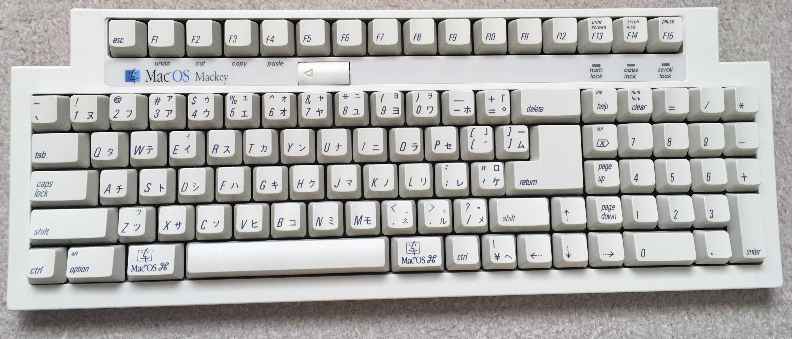

# Windows で Mac用英語キーボード のかな配列にするスクプリト

* MacUSKeyboard.ahk

下の写真のかな表示を Windows で実現します。

## 使い方

AutoHotkey で動作します。
IME.ahk も同じディレクトリに入れておきます。

## IME の設定

旧MS-IME、新MS-IME（Windows 10 version 2004）の初期状態ならば、設定をかな入力にするだけで使えます。

そのほかの場合は、かな入力に設定し、次のようにキーカスタマイズします。例は ATOK です。

* 変換	→ [文字未入力]再変換
* ひらがな	→ 入力文字種全角ひらがな(あ)
* カタカナ	→ 入力文字種全角カタカナ(ア)
* 半角/全角	→ 英語入力ON/OFF または [文字未入力]日本語ON/OFF[他]入力文字種半角無変換(A)

## 入力の切り替え方法

* 右Winキー		→ ひらがな入力　連打で再変換
* Shift + 右Winキー	→ カタカナ入力
* 左Winキー		→ 半角英数入力（または IMEオフ）・・・入力中の文字の有無で変わる
* Shift + 左キー		→ 全角英数入力　・・・IME の状態が検出できない時は動作しません（旧EDGE など）

Mac で Karabiner-Elements の「コマンドキーを単体で押したときに、英数・かなキーを送信する」を使っているかのような入力切り替え操作が可能です。

## 制限

* ｀〜 の入力は、英数入力に切り替えて行います。
* Win キー単独でスタートメニューを開けないので、その場合 Ctrl + Esc キーを使います。

## 応用

スクリプトの 17行目から70行目を削除すると、「コマンドキーを単体で押したときに、英数・かなキーを送信する」だけ使うことができます。

この部分は、全てにキーボードフックを使ったことで、参考にした「WindowsのAlt空打ちで日本語入力(IME)を切り替えるツールを作った」http://www.karakaram.com/alt-ime-on-off より短いコードになっています。
