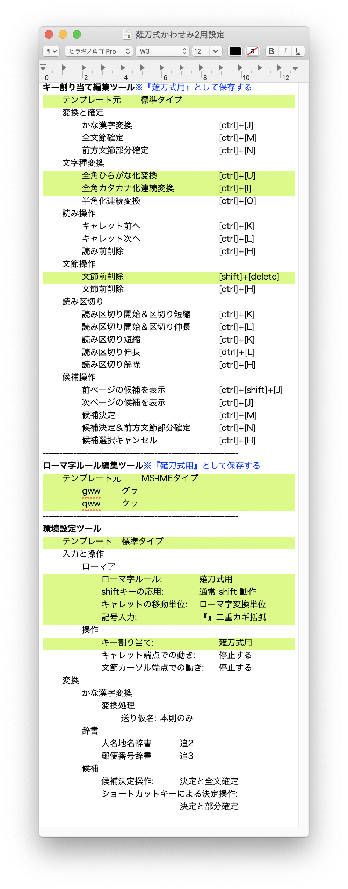

# Mac を 薙刀式 にするスクプリト

### 薙刀式配列v14（集大成版） 2021年12月10日付

参考：
[【薙刀式】v14集大成版](http://oookaworks.seesaa.net/article/484704326.html#gsc.tab=0)

Windows版、QMK版の薙刀式は、押したキーをどれか離すと計算がおこなわれ、画面に出力されます。

ですが、Mac の Karabier-Elements ではキーを押したときに、離したときの動作が決まってしまい、後で変えられません。

そこで、キーを何でも押した瞬間に出力し、もう１、２個キーを重ね押ししたら、前字削除して出し直す方法を使うようにしました。

* Naginata-Kawasemi.json

JISキーボードにもUSキーボードにも対応しています。

Karabiner-Elements で登録してください。
英語系の配列を取り除かなくてはいけません。

# 薙刀式配列v14（集大成版）+かわせみ2

### 【重要】かわせみ2 以降でのみ動作します。

かわせみ2 を私は次のように設定していますが、色が付いたところが必要な箇所です。

macOS Big Sur (11.6.1) + Karabiner-Elements (v14.3.0) + かわせみ3 (3.0) でテスト継続中です。

(インストール後サイズ: 6.7MB)

## 仕様

* 英数編集モード付
* 「秒数は関係なく、同時に押されてる瞬間があれば良い」
* ただし空白を入力するときは1秒以内にスペースキーを離す
* 編集モードは D+F や C+V、J+K、M+Comma をできれば50ミリ秒以内に押す
* キーを押してすぐ表示される文字と、キーを離してから表示される文字がある
* 縦書き版・横書き版を切り替える必要はありません

## お断り

* カーソル移動に Control+〇 を使っていますので、対応していないソフト（Microsoft Word等）があります。
* 全角英字入力中に編集モードの記号を使ったあと、半角入力になります。
* カタカナ、半角カタカナ入力中に編集モードの記号を使ったあと、ひらがな入力になることがあります。

## シフト方式

スペースキー、シフトキーのどちらもシフトとして操作できます。

## 固定名詞ショートカット

一緒に公開した Excel のワークシートで、「固定名詞」タブ内に書き込んで、次の方法でスクリプトを作成し直して、入れ換えの登録をおこなってください。

1. 「スクリプト」タブを選ぶ
2. Command + A で全てを選んでから、Command + C でコピーする
3. テキストエディットで新規書類を作り、「フォーマット」から「標準テキストにする」としてからペーストする。
4. 「Naginata.json」などのファイル名でフォルダ ~/.config/karabiner/assets/complex_modifications/ に保存する
5. Karabiner-Elements で古い登録を削除して、今度作ったものを再登録する

ワークシートは Office 365 の新機能を使っていますが、ネット上で動作する Office でも使えます。

１個所あたり２０文字までとしました。２０文字の入力に２〜６秒かかります。
ただし絵文字などの拡張文字は、文字数を倍も使います。

## 英語系配列

英語系の配列は、Excel ワークシートの「キー設定」タブの JISキーボード の文字を入れ替え、上の方法でスクリプトを作成して登録すれば使えます。

なお、入れ替えにとどめてください。
設定されていない文字があると正しいスクリプトが作れませんので Karabiner-Elements に登録できません。

パスワード入力時は無効、Command、Option、Controlキーと併用時も無効です。

# Q & A

### Q1. １つ目のキーを押した瞬間に出力がおきて、選択範囲が削除されますが。

A1. 編集モードは、できるだけ D+F、C+V などの隣り合う２キーの組み合わせを同時押し(初期設定で50ミリ秒以内)してから、３つ目のキーを押してください。

### Q2. かな変換中に V+M を押したら、確定+改行とになった。

A2. V+M を同時押し(初期設定で50ミリ秒以内)してください。

そして、次の操作の前にどちらのキーも離しましょう。

### Q3. スペース、左、右、BS の反応が悪い。

A3. これらのキーは、離したときに実行されます。

### Q4. スペース、左、右、BS を長押ししてから離したら、なにも起きない。

A4. Karabiner-Elements 設定の「Complex Modifications」項目内「Parameters」タブの
「to_if_alone_timeout_milliseconds」の値を長くしてみてください。
初期設定は1000ミリ秒（１秒）です。

D+F の同時押し(シンクロ。以下同)、C+V、J+K、M+Comma の同時押しから、長押しして離してもなにも入力されません。

### Q5. スペース(シフト)を押しながら「が」といった２キー押しをすると、「あが」などと入力される

A5. かわせみ2 のキー割り当て編集ツールで、「読み操作」内の「文節前削除」に [shift]+[delete] を加えます。

[shift]+[delete] を、カーソル位置削除としてどうしても使いたいときは、https://ke-complex-modifications.pqrs.org(公式)の Change delete key で利用できます。

### Q6. 編集モードのカーソル移動ができない

A6. できないソフトでは、通常のカーソルを使ってください。
例えば Microsoft Word がそうです。

テキストエディットはできます。

## 変数（技術情報）

* USC: 未確定文字の数（０〜２）

例：あ＋る→ある＋し→じょ　「ある」を入力したところで２、「し」を入力されたら２文字削除して「じょ」を入力する。

確定する複数キー押し、キーを離したときは０になります。

* LKS: 直前の文字の押しキーの数 （１〜２）

ロールオーバーで２キー同時押しが続くときに、前の文字を消すことなく新しい文字を入力するために用意。

３キー押し（シフトを数えず）は全て確定になるので、３の代入を省略しています。

例：語尾、ボビン、ポピー

## 参考

* [【薙刀式】v14集大成版](http://oookaworks.seesaa.net/article/484704326.html#gsc.tab=0)
* [Karabiner-Elementsの設定項目をまとめました](https://qiita.com/s-show/items/a1fd228b04801477729c)
* [Documentation | Karabiner-Elements](https://karabiner-elements.pqrs.org/docs/)
* [Mac薙刀式v11 sorshi版](https://github.com/sorshi/KE-complex_modifications-NAGINATA)
* [Mac 記号や特殊文字のキーボードショートカットまとめ](http://inforati.jp/apple/mac-tips-techniques/system-hints/how-to-use-special-characters-and-symbols-keyboard-shortcut-with-macos.html)
* [Mac のキーボードショートカット](https://support.apple.com/ja-jp/HT201236)
* [Mac で日本語の英字とかなの文字対応を調べる](https://support.apple.com/ja-jp/guide/japanese-input-method/jpim10277/6.2.1/mac/10.14)
* [薙刀式v13 QMK版](https://github.com/eswai/qmk_firmware/tree/master/keyboards/crkbd/keymaps/naginata_v13u)

## おもな修正履歴

* 「[【薙刀式】v14集大成版](http://oookaworks.seesaa.net/article/484704326.html#gsc.tab=0)へ対応

(ここまで2021年12月12日追加)
