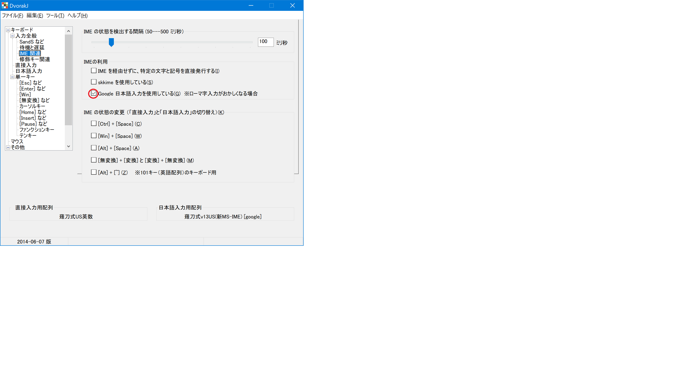

# 新MS-IME で薙刀式v13完成版を使う方法

初期設定のままの新MS-IME と DvorakJ で薙刀式を使えるようにする方法です。

## 1. 薙刀式v13完成版.txt の書き換え

### 87行目 ‘ → (半角)`
ろ|け|と|か|っ  |く  |あ  |い|う|ー|’|` |

### 861行目 IME ON
* (第１案) 変換 → (Mac)かな

  |  |  |  |  |  |{vk16}|  |  |  |  |  |

* (第２案)Windowsの更新状況や、キーボード・ドライバが特殊で、第１案が動かない場合

  |  |  |  |  |  |{vkF2}|  |  |  |  |  |

### 866〜868行目 IME OFF
* (第１案) 無変換 → (Mac)英数

  |  |  |      |  |  |  |  |  |  |  |  |

  |  |  |{vk1A}|  |  |  |  |  |  |  |  |

  |  |  |      |  |  |  |  |  |  |  |

* (第２案)Windowsの更新状況や、キーボード・ドライバが特殊で、第１案が動かない場合

  |  |  |            |  |  |  |  |  |  |  |  |

  |  |  |{vkF2}{vkF3}|  |  |  |  |  |  |  |  |

  |  |  |            |  |  |  |  |  |  |  |

### 899〜901行目 編集モード
^{End}|｜{改行}|/*ディ*/|^s      |・     ||||||||

……  |《      |？{改行}|「{改行}|({改行}||||||||

││  |》      |！{改行}|」{改行}|){改行}|||||||

### 917〜919行目 編集モード
／|｜{改行}{End}《》{↑}|{Home}{改行}{Space 3}{End}|{Home}{改行}{Space}{End}|〇||||||||

【|〈                   |『                        |」{改行 2}「{改行}      |{Space 3}||||||||

】|〉                   |』                        |」{改行 2}{Space}       |　　　×　　　×　　　×{改行}|||||||

※ 使ってみて{改行}が多すぎるところを減らした

## 2. 薙刀式v13英数.txt の書き換え

薙刀式v13完成版.txt の書き換えを参考にしてください。

## 3. DvorakJ の設定

DvorakJ の設定画面で、「IME 関連」の「Google 日本語入力を使用している」のチェックを入れる

## 4. DvorakJ を一旦終了し、再び起動する

# 新MS-IME を使用することによる問題点

残念ながら、新MS-IME には使用をためらうような問題点があります。

* 未確定状態の文字があるときに、記号入力をするとカーソル位置でなく先頭に入力される記号があり、しかもソフトウェアが停止することがある。
これは、alt + テンキー数字 の入力でも起きる問題です。

* 変換窓が開いているときに英数に切り替え、文字を入力しても、最初の文字は入らない。
