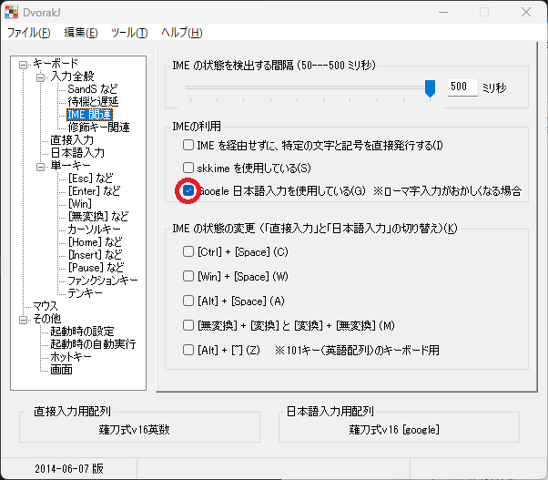
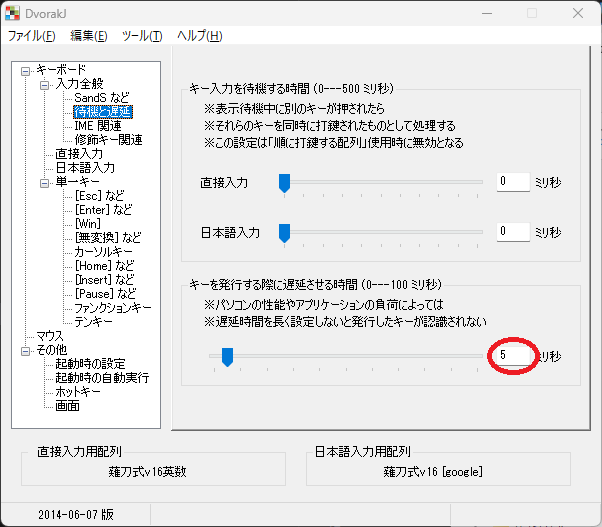

# 新MS-IME で薙刀式配列v16（快速版）を使う方法
DvorakJ版薙刀式を新MS-IMEでも使えるようにする方法です。
## 1. 薙刀式v16.txt の書き換え
### 836〜838行目 IME OFF
```
  |  |  |      |  |  |  |  |  |  |  |  |
  |  |  |{vkF2}{vkF3}|  |  |  |  |  |  |  |  |
  |  |  |      |  |  |  |  |  |  |  |
```
### 876〜878行目 編集モード１ 左手
```
^{End}    |／{改行}|/*ディ*/|^s      |・      ||||||||
・{改行}{BS}{vkF3}……{vkF3}|『{改行}|？{改行}|「{改行}| ({改行}||||||||
――{改行}|』{改行}|！{改行}|」{改行}| ){改行}|||||||
```
JK+A を書き換えただけです
### 893〜895行目 編集モード２ 左手
```
｜{改行}|・{改行}{BS}{vkF3}　　　×　　　×　　　×{改行}{vkF3}|{Home}{→}{End}{Del 2}{←}|{Home}{改行}{Space 1}{←}|○{改行} ||||||||
《{改行}|【{改行}                        |{Home}{→}{End}{Del 4}{←}|{Home}{改行}{Space 3}{←}|{Space 3}||||||||
》{改行}|】{改行}                        |」{改行}{改行}            |」{改行}{改行}「{改行}   |」{改行}{改行}{Space}|||||||
```
MComm+W を書き換えただけです
## 2. DvorakJ の設定
DvorakJ の設定画面で、「IME 関連」の「Google 日本語入力を使用している」のチェックを入れる



「……」または「　　　×　　　×　　　×」を入力した際に「・」が残るのが気になったら、
「待機と遅延」の「キーを発行する際に遅延させる時間」を 30, 40, 50, 60 の順に書き換えてみる


## 3. DvorakJ を一旦終了し、再び起動する
# 新MS-IME を使用することによる問題点
残念ながら、新MS-IME には使用をためらうような問題点があります。
* 変換窓が開いているときに、英数入力に切り替えて文字を入力すると最初の文字は入らない。
* 文字入力中に編集モードの入力キャンセルをしても、推測入力の窓が残る。
* キーカスタマイズがほとんどできないばかりか、こまかな操作方法もわからなくなる。
# 参考
* [【薙刀式】v16快速版発表](http://oookaworks.seesaa.net/article/509198141.html#gsc.tab=0)
