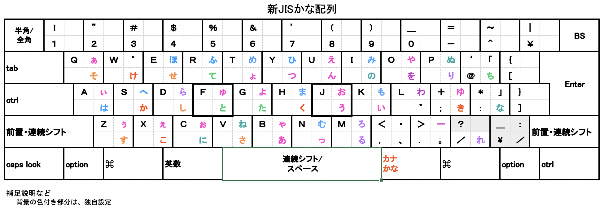
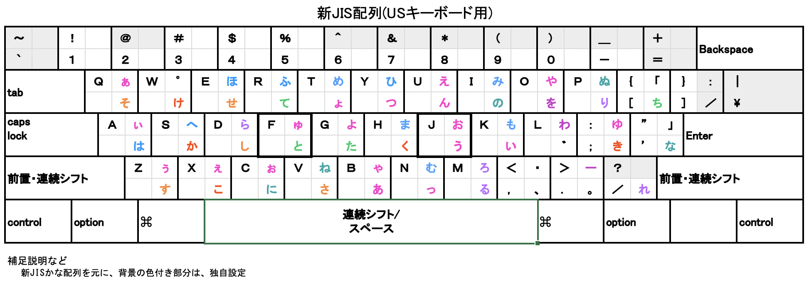

# Mac を 新JISかな配列 にするスクプリト

* SinJIS_Layout.json

JISキーボードにもUSキーボードにも対応しています。

使いたい方を、Karabiner-Elements に英語系の配列より上に登録してください。

## シフト方式

* 左右シフト：前置・連続シフト
* スペースキー：連続シフト 兼 スペース（リピートなし）

押してすぐ離した次のキーにもシフトがかかる前置・連続シフトが、左右シフトで使えるので、一本指打法で使えます。

Karabiner-Elements の to_if_alone_timeout_milliseconds の設定時間（通常１秒）以上、左右シフトを押してから離すと、シフト解除します。

# 新JIS配列+ローマ字入力

入力方法にローマ字入力を使うように、ＩＭを設定してください。

macOS Mojave (10.14.6) + Karabiner-Elements (v12.10.0) + 日本語IM あるいは かわせみ2 (2.0.17) で動作確認しました。

### 制限

* 濁音、半濁音を、後からさかのぼって付け直すことはできません。
* 日本語ＩＭのライブ変換は、非常にもたつきます。

### 応用

スクリプトの 18-676 行目を消すと、スペースバーだけ連続シフトとなり、左右のシフトを押しながらでは一時的な英数入力になります。
ＩＭ設定で、Shiftキーの動作を「英字モードに入る」にします。

# 新JIS配列+日本語IMかな入力

入力方法にかな入力を使うように、日本語ＩＭを設定してください。

macOS Mojave (10.14.6) + Karabiner-Elements (v12.10.0) + 日本語IM で動作確認しました。

### 制限

* Caps Lock は、「あうえおやゆよわ…」などの入力の際に、(シフト側の文字が入力されないように)解除されます。
* そのため、Caps Lock の設定を見直さないと、うまく動かないかもしれません。

# 新JIS配列+かわせみ2 ※設定必要

かわせみ2 をカスタマイズしないで使っている場合は、かな入力を使うようにするだけです。

macOS Mojave (10.14.6) + Karabiner-Elements (v12.10.0) + かわせみ2.0.17 で動作確認しました。

### かわせみ2 をカスタマイズしている場合

あらかじめ、設定の書き出しをしておくことをおすすめします。

かわせみ2 の環境設定ツールで、
* 入力方法： かな入力
* かな入力： control キーで英数入力する

のように、設定してください。

さらに、かわせみ2 の キー割り当て編集ツール で
× control + 0〜9
× shift + control + 0〜9
× control + A〜F
× control +  -^[];:,./ などの記号
× shift + control + -^[];:,./ などの記号

には機能を設定しないようにします。
