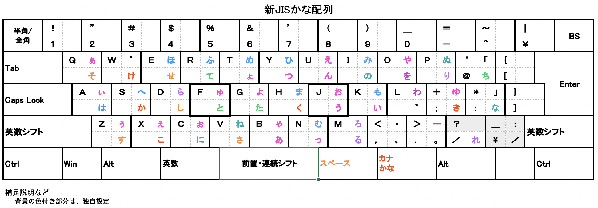
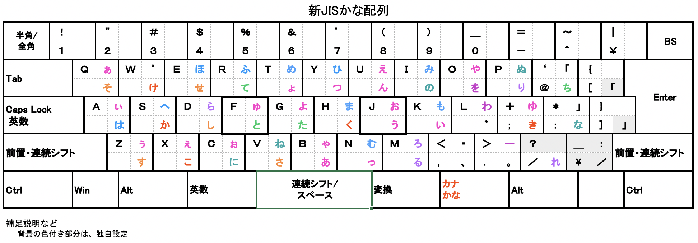

# Windows で 新JISかな配列 にするスクプリト

エスリルさんが作成したスクリプトファイル（https://github.com/esrille/new-stickney にある x6004.ahk）をもとに、機能追加
と修正を行いました。

* x6004.ahk または x6004SS.ahk

IME.ahk、x6004_0.ico、x6004_1.ico、x6004_2.ico、x6004_UD.ico の５ファイルも同じディレクトリに入れておきます。

## 入力の切り替え方法

* ひらがなキー		→ ひらがな入力　連打で再変換
* Shift + ひらがなキー	→ カタカナ入力
* 無変換キー		→ 半角英数入力（または IMEオフ）…入力中の文字の有無で変わる）
* Shift + 無変換キー	→ 全角英数入力
* 半角/全角キー		→ ひらがな入力 と 半角英数入力 の切り替え

Mac のような入力切り替え操作が可能です。

## ＩＭＥの設定

新ＭＳ–ＩＭＥ（Windows 10 version 2005）では、設定を初期状態にします。（旧ＭＳ–ＩＭＥもこれで動きます）

他のＩＭＥの場合を、ＡＴＯＫを例に説明します。
ローマ字入力に設定し、次のようにキーカスタマイズします。

* ひらがな	→ 入力文字種全角ひらがな(あ)
* カタカナ	→ 入力文字種全角カタカナ(ア)
* 無変換	→ [文字未入力]日本語入力OFF, [他]入力文字種半角無変換(A)

## Center SHIFT only 内の x6004.ahk

### シフト方式

* スペースキー：前置・連続シフト
* 変換キー：スペース
* 左右シフト：英数シフト（一時的な英数入力になります）

押してすぐ離した次のキーにもシフトがかかる前置・連続シフトが使えるので、一本指打法で使えます。

Windows のキーボードのリピート設定時間（通常０.５〜１秒）以上、左右シフトを押してから離すと、シフト解除します。

### 制限

* 濁音、半濁音を、後からさかのぼって付け直すことはできません。
* 新ＭＳ–ＩＭＥ（Windows 10 version 2005）では、左右シフトを押しっぱなしにしないと、一時的な英数入力がうまく動きません。

## with Side SHIFT 内の x6004SS.ahk

### シフト方式

* 左右シフト：前置・連続シフト
* スペースキー：連続シフト 兼 スペース（リピートあり）

押してすぐ離した次のキーにもシフトがかかる前置・連続シフトが、左右シフトで使えるので、一本指打法で使えます。

Windows のキーボードのリピート設定時間（通常０.５〜１秒）以上、左右シフトを押してから離すと、シフト解除します。

### 制限

* 濁音、半濁音を、後からさかのぼって付け直すことはできません。

## 機能追加と修正箇所

* Windows 10 version 2005 の ＭＳ–ＩＭＥ に対応させるため、ローマ字入力化。

1.ユニコード文字入力（元にしたスクリプトの方式）、
2. Alt を押しながらテンキー入力、
3.ローマ字入力←→かな入力をスクリプトから切り替える、
のいずれにも対応しなくなったため、この方式にしました。

* シフトを増やしやすくするため、実装方法を変更。

* シフト状態をタスクバーのアイコンで表示。

シフトの ON/OFF をアイコンで表示します。

ＩＭＥの状態が検出できないと、２秒間だけ「？」アイコンで表示します。
この状態でもかな入力が可能です。（旧ＥＤＧＥに対応しています）

* IME 操作
